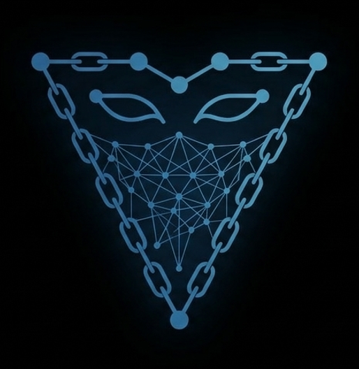

<p align="center">
  
</p>

<h1 align="center">Veil</h1>

<p align="center">
  Identity infrastructure for AI agents.
  <br />
  <a href="https://veil-rose.vercel.app/">Live Demo</a> &middot; <a href="https://www.youtube.com/watch?v=tuQPsiSOqEE">Video</a> &middot; <a href="https://github.com/RITTUVIK/Veil">GitHub</a>
</p>

---

AI agents are anonymous. When an agent takes an action, makes a payment, or communicates with another agent, there is no way to know who built it, who is accountable for it, or whether it can be trusted.

Veil solves the identity side with a single SDK call. Your agent gets a `.eth` name, an ERC-8004 on-chain passport, and a cryptographic link between the agent wallet and the human who controls the parent ENS domain.

---

## What it does

`registerAgentIdentity()` executes seven on-chain steps against Sepolia by default:

1. Create `myagent.veilsdk.eth` as a subdomain under the root ENS name
2. Attach the public resolver to the name
3. Set the name's `addr` record to the agent wallet address
4. Claim the reverse record for the agent address (sent from the agent wallet)
5. Set the reverse name so the agent wallet resolves back to the ENS name
6. Register the agent in the ERC-8004 Identity Registry
7. Link the agent wallet via `setAgentWallet` using an EIP-712 signature from the agent key

The result is an agent with a human-readable name, a verifiable on-chain passport, and a provable connection to its owner. All in one call.

---

## SDK usage

### Default: register under veilsdk.eth

The simplest way to get started. Your agent is registered as a subdomain under `veilsdk.eth`.

```ts
import { registerAgentIdentity } from "veil";

const result = await registerAgentIdentity({
  provider,
  humanSigner,                          // your wallet, must own veilsdk.eth on Sepolia
  agentSigner,                          // the agent's wallet, signs the EIP-712 proof
  agentWalletAddress: "0xAgentWallet",
  label: "myagent",
});

console.log(result.agentEnsName); // myagent.veilsdk.eth
console.log(result.txHashes);     // seven Ethereum transaction hashes
```

### Custom domain: register under your own .eth name

If you own a `.eth` name on Sepolia, pass it as `rootName` and your agents will live under your domain instead.

```ts
import { registerAgentIdentity } from "veil";

const result = await registerAgentIdentity({
  provider,
  humanSigner,                          // your wallet, must own john.eth on Sepolia
  agentSigner,                          // the agent's wallet, signs the EIP-712 proof
  agentWalletAddress: "0xAgentWallet",
  label: "myagent",
  rootName: "john.eth",
});

console.log(result.agentEnsName); // myagent.john.eth
console.log(result.txHashes);     // seven Ethereum transaction hashes
```

All steps are idempotent. If a step was already completed on a previous run it is skipped and the function continues from where it left off.

---

## Mainnet compatible

The SDK works on any EVM chain with ENS and ERC-8004 deployed. Pass the appropriate contract addresses:

```ts
await registerAgentIdentity({
  provider: mainnetProvider,
  humanSigner,
  agentSigner,
  agentWalletAddress: "0x...",
  label: "myagent",
  rootName: "mydomain.eth",
  publicResolverAddress: "0x231b0Ee14048e9dCcD1d247744d114a4EB5E8E63",
  reverseRegistrarAddress: "0xa58E81fe9b61B5c3fE2AFD33CF304c454AbFc7Cb",
  identityRegistryAddress: "0x...", // ERC-8004 on mainnet
});
```

---

## Demo app

The demo is a React app built with Vite. It walks through the full registration flow and then shows an agent dashboard with identity details, an ENS name greeting, and integration with Locus spend wallets and Status Network.

**Live:** [veil-rose.vercel.app](https://veil-rose.vercel.app/)

**To run locally:**

```bash
cd demo
npm install
npm run dev
```

Open `http://localhost:5173` and connect a wallet on Sepolia.

After the seven identity steps complete, the demo registers the agent with Locus (step 8) and logs the registration on Status Network (step 9), then displays a spend controls dashboard showing wallet status, policy tiers, and a USDC send form.

---

## Architecture

```
src/                          TypeScript SDK (package name: veil)
  veil/                       registerAgentIdentity, agent URI helpers
  ens/                        namehash, labelhash utilities
contracts/                    VeilSubdomainRegistrar (Solidity)
scripts/                      deployment and ENS management scripts
demo/                         React demo app
  src/
    wagmi.ts                  chain and wallet configuration
    lib/ethersAdapter.ts      converts wagmi WalletClient to ethers signer
    services/locus.ts         Locus adapter with simulation and live API support
    services/statusNetwork.ts gasless agent logging on Status Network
    components/               IdentityCard, LocusCard, ExecutionCard
    App.tsx                   registration flow and dashboard
```

---

## Network

Everything runs on **Sepolia testnet** by default. No mainnet transactions are made unless you override the provider and contract addresses.

| Contract | Address |
| --- | --- |
| ENS Registry | `0x00000000000C2E074eC69A0dFb2997BA6C7d2e1e` |
| ENS Public Resolver | `0xE99638b40E4Fff0129D56f03b55b6bbC4BBE49b5` |
| ENS Reverse Registrar | `0xA0a1AbcDAe1a2a4A2EF8e9113Ff0e02DD81DC0C6` |
| ERC-8004 Identity Registry | `0x8004A818BFB912233c491871b3d84c89A494BD9e` |

---

## Status Network integration

After identity registration, the demo logs the agent's ENS name on Status Network Sepolia Testnet via a gasless transaction (gas = 0). This uses the AgentRegistry smart contract deployed on Status Network.

| Property | Value |
| --- | --- |
| Chain ID | `1660990954` |
| RPC URL | `https://public.sepolia.rpc.status.network` |
| AgentRegistry contract | `0x5740a90c0193101998bC27EBFb8e3705f7A4672A` |

Transactions are gasless because Status Network uses RLN (Rate Limiting Nullifier) to replace gas fees with cryptographic rate limits.

---

## Built for

[The Synthesis Hackathon 2026](https://synthesis.md)

- ENS Identity
- ENS Communication
- ENS Open Integration
- Student Founder's Bet
- Status Network
- Synthesis Open Track

---

## Why Veil

Agents need identity for the same reason humans do. So others know who they are, someone stays accountable, and trust does not require a central authority.

ENS is the username. ERC-8004 is the passport. Veil connects them in one call.
